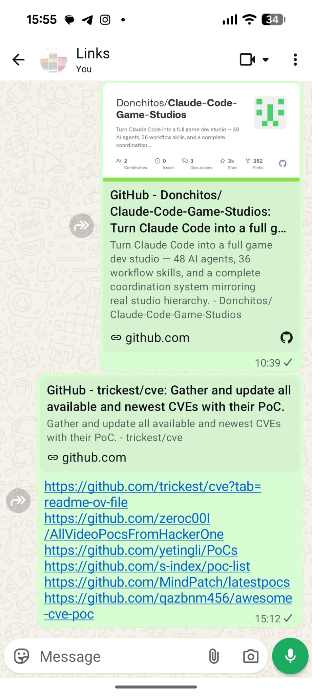
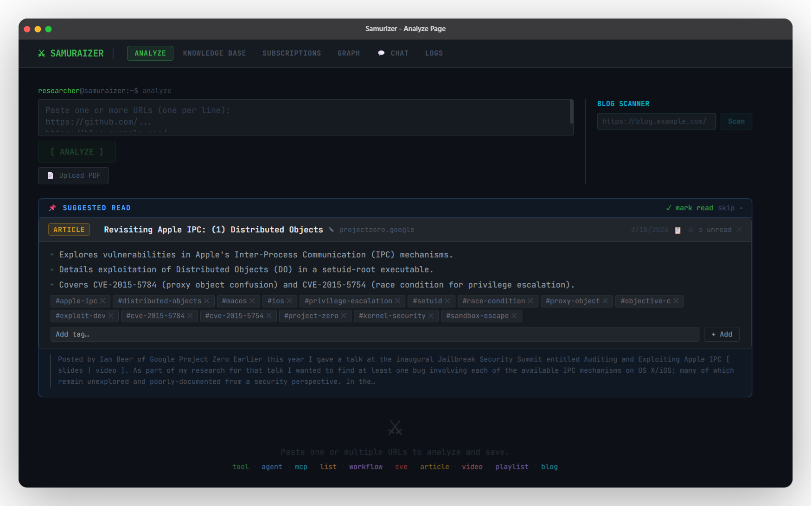
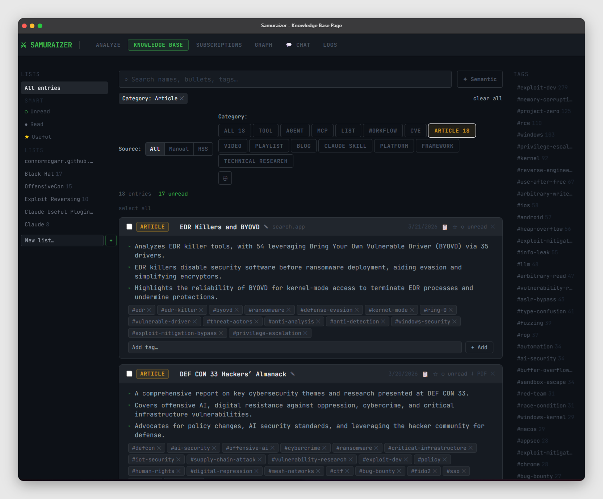
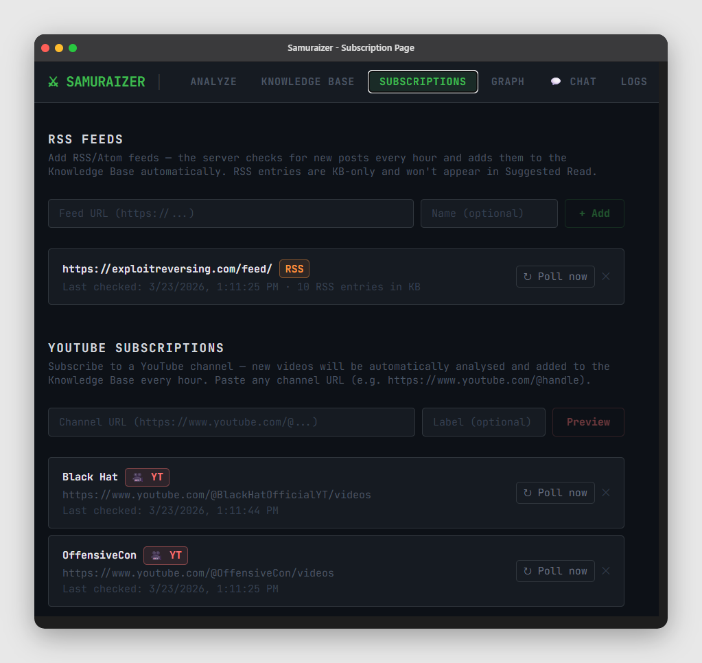
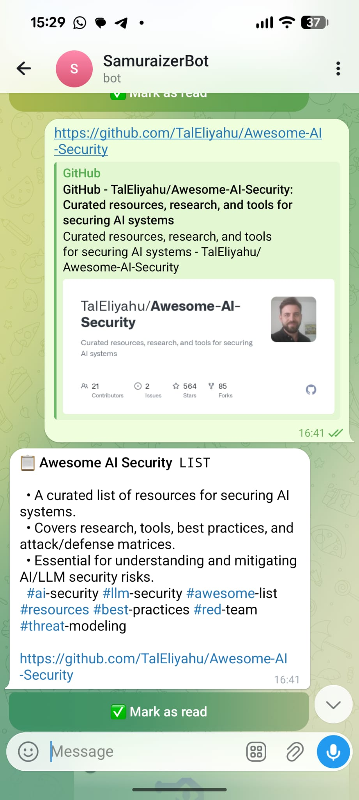
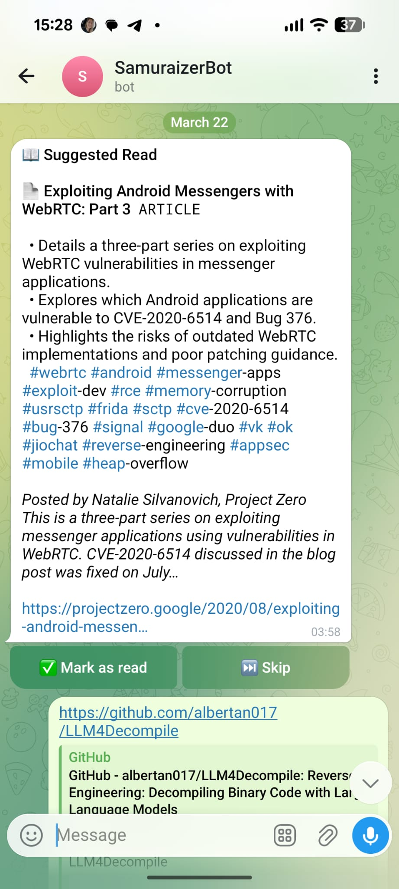
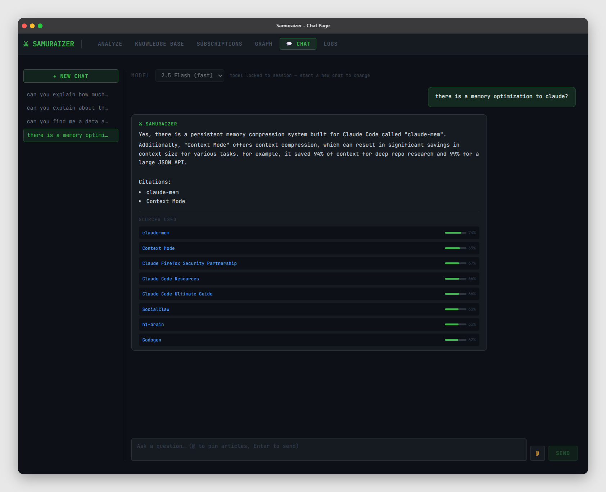
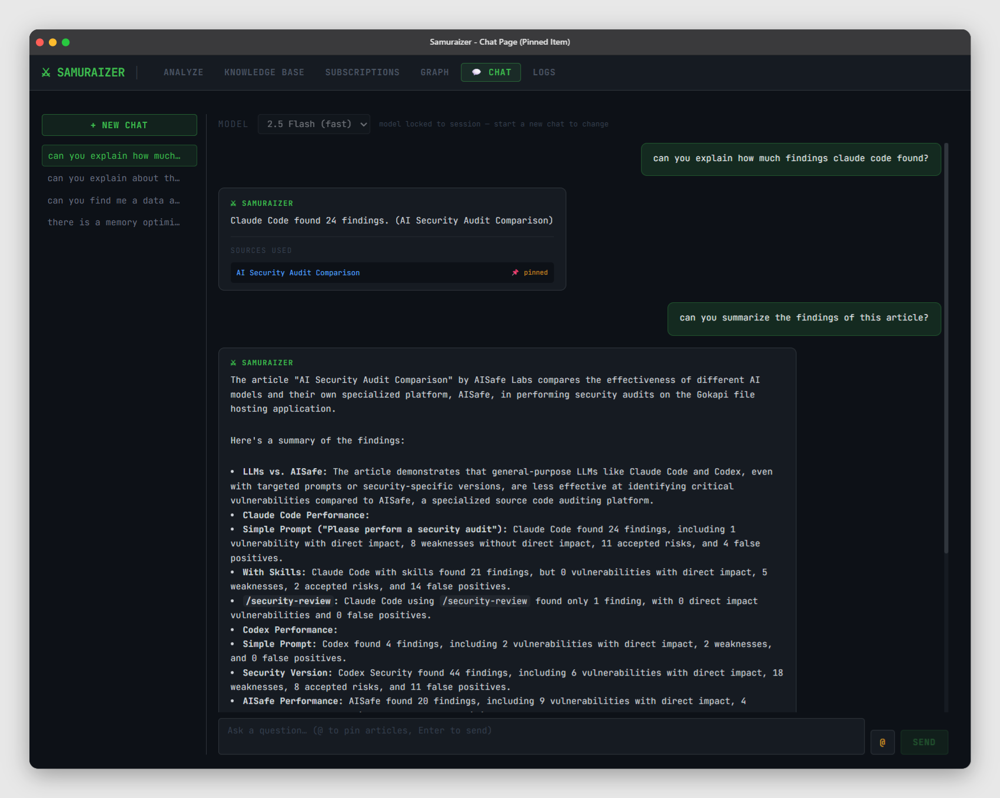
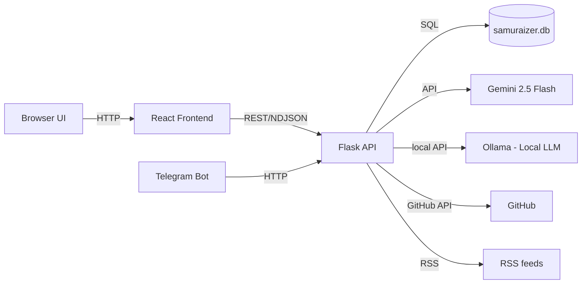

<div align="center">
  
</div>

# Samuraizer — Cyber‑Security Knowledge Base Engine

<div align="center">

**NotebookLM on steroids — purpose-built for security researchers.** 
</br></br>
[](README.md)  <br>[](LICENSE) [](https://www.python.org/) [](https://reactjs.org/) 

</div>


## 💡 Why Samuraizer?

Every security researcher knows the feeling — you find an interesting GitHub repo, a fresh CVE writeup, a blog post about a new exploitation technique. You forward it to yourself on WhatsApp. It immediately drowns in the chat. Weeks later you actually need that article — and it's gone.

***Stop sending yourself links you'll never find again — send them to Samuraizer once, and they're summarized, tagged, and searchable forever.***

<div align="center">
<table>
<tr>
<th>Before 😵</th>
<th>After 🗡️</th>
</tr>
<tr>
<td align="center"><br/><sub>Scattered links drowning in chat history</sub></td>
<td align="center"><br/><sub>Analyzed, tagged, and ready to be found</sub></td>
</tr>
</table>
</div>

## 🔐 Local-first privacy (local-only feature)

🎯 **Extra privacy mode (local only)** — run with `ollama`, all data stays on your machine.

- 🗄️ Local vector storage in `samuraizer.db` + local AI embeddings via Ollama.
- ⚡ Works fully offline once models are pulled (`ollama pull qwen3:4b`, `ollama pull qwen3-embedding:8b`).
- ✅ Great for security teams and researchers who require air-gapped/isolated setups.


---

## 🧩 What you get (at-a-glance)

### 🔍 Analyze — Paste URLs, watch results stream
- 📝 Paste one or more URLs (GitHub repos, CVE writeups, blog posts, YouTube videos) — results stream back in real time
- 📄 **Upload PDF files** directly from the browser or Telegram — full text extracted, analyzed, stored, and viewable in the UI
- 🗞️ Blog scanner: paste a blog homepage and extract all article links for batch analysis in one click
- ✨ **Suggested Read**: a relevant unread entry is surfaced on the Analyze tab each session to keep your queue moving

<div align="center"></div>

### 🗂️ Knowledge Base
- ✏️ Inline tag editing (add/remove tags on entries, feeds, and list items)
- 🔎 Semantic search (vector search via Gemini embeddings) + classic full-text search
- 🧩 Tag cloud + multi-filtering (by tag, category, source, list, read/useful)
- 📚 List management — group entries into manual lists, RSS lists, or channel lists
- 👁️‍🗨️ Hover preview (summary cards) and quick copy buttons

<div align="center"></div>

### 🗺️ Knowledge Graph
- Visualize your entire knowledge base as an interactive force-directed graph
- Entries and tags are nodes — edges show which tags link to which articles
- Click to preview an entry; double-click to open the original URL
- Color-coded by category (CVE, article, tool, video, blog, etc.)
- Search tags to highlight related clusters across the graph

<div align="center"></div>

### 📡 RSS Feeds & YouTube Subscriptions
- Add RSS/Atom feeds — the server polls hourly and auto-ingests and summarizes new posts
- New posts are automatically added to the Knowledge Base
- Each feed becomes its own list, making it easy to batch-review
- Feed items show source metadata and can be tagged/filtered like any entry

### 🎥 YouTube Channel Subscriptions
- Subscribe to YouTube channels via URL (e.g. https://www.youtube.com/@handle, /channel/UCxxx)
- Preview latest videos before subscribing and select which videos to analyze
- On subscribe, selected videos are analyzed immediately; future uploads are auto-polled hourly
- Runs via `/yt-channels` API and appears in the UI under RSS/YT sections

<div align="center"></div>

### 🤖 Telegram Bot (Optional)
- Send any URL to the bot — it analyzes it through the same backend and returns a formatted card
- **Send a PDF file** — it downloads, analyzes, and returns a result card with a link to view/download the file
- Live progress updates streamed as the analysis runs
- Receives a **Suggested Read** notification — the bot proactively surfaces unread entries

<div align="center">
<table>
<tr>
<td align="center"><br/><sub><b>Analyzing a URL</b></sub></td>
<td align="center"><br/><sub><b>Daily Suggested Read</b></sub></td>
</tr>
</table>
</div>

### 💬 Chat (RAG + streaming + pinned context)
- Ask questions over your knowledge base — answers are cited from the best matching entries
- ⚡ Streaming responses with live typing and per-source relevance scores
- 🗂️ Multiple chat sessions with saved history and model selection
- 📌 **Pin specific articles** as context — type `@` for autocomplete or use the `@` browse button
  - When entries are pinned, Gemini answers **only** from those articles — no RAG noise
  - Pinned entries appear as chips above the input; sources show a 📌 badge instead of a score
  - Perfect for deep-diving a specific PDF, writeup, or CVE

<div align="center">
<table>
<tr>
<td align="center"><br/><sub><b>RAG chat with source scores</b></sub></td>
<td align="center"><br/><sub><b>Pinned-context chat</b></sub></td>
</tr>
</table>
</div>

> [!IMPORTANT]
> **Shape the Future of Samuraizer!** We are currently voting on new features like Local LLMs and Obsidian export.
[**Cast your vote here!**](https://github.com/zomry1/Samuraizer/discussions/7)

---

## 🏗 Architecture (high-level)



---

## 🧠 How it works (end-to-end)

1. **Submit a URL or PDF** via the web UI (or Telegram bot).
2. Backend determines the type (GitHub repo, blog post, RSS feed, PDF, etc.) and fetches/extracts content.
3. Content is sent to **Gemini 2.5 Flash** to generate:
   - A concise summary
   - A category and tags
   - (Optionally) embeddings used for semantic search
4. Results are stored in `samuraizer.db` and surfaced in the frontend.
5. The frontend lets you:
   - Filter by tags, category, source, list, read/useful flags
   - Edit tags inline (updates persisted via `PATCH /entries/<id>`)
   - Use semantic search (vector search over Gemini embeddings)
6. RSS feeds are polled periodically; new posts are automatically ingested.

---

## 🧰 Tech Stack

| Layer     | Tech / Libraries                      |
|-----------|----------------------------------------|
| Backend   | Python, Flask, SQLite, feedparser, PyMuPDF |
| LLM       | Gemini 2.5 Flash (Gemini API), Ollama (local optionally) |
| Frontend  | React 18, Vite, Tailwind CSS           |
| Bot       | python-telegram-bot v20                |
| Transcripts | [transcriptapi.com](https://transcriptapi.com) |


---

## ⚙️ Setup (Local)

### 0) Clone the repo 📥

```bash
git clone https://github.com/zomry1/Samuraizer.git
cd Samuraizer
```

### 1) Config 🔐
Copy `.env.example` to `.env` and fill in your values.
You can also open the web UI, go to the **Settings** tab, and adjust settings there (provider, API keys, Ollama model names, embedding model names) before save.

```bash
cp .env.example .env
```

| Variable | Required | Where to get it |
|---|---|---|
| `LLM_PROVIDER` | No | `gemini` (default, cloud) or `ollama` (local) |
| `GEMINI_API_KEY` | When `gemini` | [Google AI Studio → Get API key](https://aistudio.google.com/app/apikey) |
| `OLLAMA_URL` | When `ollama` | Ollama API URL (default: `http://localhost:11434`) |
| `OLLAMA_MODEL` | When `ollama` | Reasoning model (default: `qwen3:14b`) |
| `OLLAMA_EMBED_MODEL` | When `ollama` | Embedding model (default: `qwen3-embedding:8b`) |
| `TELEGRAM_BOT_TOKEN` | No | [Create a bot with @BotFather on Telegram](https://t.me/BotFather) |
| `GITHUB_TOKEN` | No | [GitHub → Settings → Developer settings → Personal access tokens](https://github.com/settings/tokens) — raises API rate limit from 60 to 5,000 req/hr |
| `TRANSCRIPTAPI` | No | [transcriptapi.com/dashboard/api-keys](https://transcriptapi.com/dashboard/api-keys) — required for YouTube transcript fetching |
| `SAMURAIZER_URL` | No | URL of your backend (default: `http://localhost:8000`), used by the Telegram bot |

<details>
<summary><b>🏠 Local Mode (Ollama)</b></summary>

Run Samuraizer fully offline with [Ollama](https://ollama.com):

```bash
# Install Ollama CLI (platform-dependent)
# macOS
curl -fsSL https://ollama.com/install.sh | sh

# Windows
irm https://ollama.com/install.ps1 | iex

# Linux (Ubuntu/Debian)
curl -fsSL https://ollama.com/install.sh | sh
```

```bash
# Start Ollama service
ollama serve

# Install models
ollama pull qwen3:4b            # reasoning
ollama pull qwen3-embedding:8b  # embeddings

# Set provider in .env
LLM_PROVIDER=ollama
```

If you already have Gemini embeddings, switching to Ollama will automatically wipe them on next startup (dimension mismatch). Re-embed via the UI or `POST /entries/embed-all`.

</details>

### 2) Install dependencies 📦

```bash
# Create and activate a virtual environment
python -m venv .venv
source .venv/bin/activate  # On Windows: .venv\Scripts\activate

pip install -r requirements.txt

cd frontend
npm install
cd ..
```

### 3) Run backend ▶️

```bash
python server.py
```

### 4) Run frontend 🌐 *(new terminal)*

```bash
cd frontend
npm run dev
```

### 5) (Optional) Run Telegram bot 🤖 *(new terminal)*

```bash
python telegram_bot.py
```

---


<details>
<summary>📺 YouTube Transcript Fetching</summary>

### Why not `youtube-transcript-api`?

The original implementation used the open-source [`youtube-transcript-api`](https://github.com/jdepoix/youtube-transcript-api) Python library. It works well locally but has a critical limitation in practice: **YouTube aggressively blocks IP addresses** that make automated transcript requests, especially:

- IPs belonging to cloud providers / VPS hosts (AWS, GCP, Azure, Hetzner, etc.)
- IPs that hit the transcript endpoint too frequently

This meant that after analyzing just a handful of videos, the whole server would get blocked and every subsequent transcript fetch would fail with an `IPBlocked` / `RequestBlocked` error — completely breaking YouTube video analysis.

### Current solution: `transcriptapi.com`

Samuraizer now uses [transcriptapi.com](https://transcriptapi.com) — a third-party paid API that handles the YouTube transcript fetching on their end, routing through infrastructure that isn't blocked.

**Pros:**
- No IP blocks — they manage the anti-bot problem for you
- Simple REST API (`GET /api/v2/youtube/transcript`)
- Free tier available; credits only charged on success (HTTP 200)
- Retryable error codes (408 / 503) with clear semantics

**Cons:**
- Not free beyond the free tier (credit-based billing)
- External dependency — if their service is down, transcript fetching fails
- Data goes through a third party

**Setup:** Add to `.env`:
```env
TRANSCRIPTAPI=your_key_here
```
Get a key at [transcriptapi.com/dashboard/api-keys](https://transcriptapi.com/dashboard/api-keys).

### Alternatives worth considering

| Option | How it works | IP block risk | Cost |
|--------|-------------|--------------|------|
| **[transcriptapi.com](https://transcriptapi.com)** *(current)* | Managed REST API | None (their problem) | Credit-based |
| **[yt-dlp](https://github.com/yt-dlp/yt-dlp)** | Downloads subtitles via `--write-sub --skip-download` | Low (mimics browser) | Free, self-hosted |
| **`youtube-transcript-api` + cookies** | Pass a Netscape cookies.txt from a logged-in browser session | Medium (burner account risk) | Free |
| **YouTube Data API v3** | Official Google API, no scraping | None | Free quota, then paid |
| **[Supadata](https://supadata.ai)** | Similar managed REST API | None | Free tier (100 req/day) |

**Best free alternative:** `yt-dlp` — it is actively maintained, mimics real browser requests, and is unlikely to get blocked as quickly as a plain HTTP request. To switch, replace `_fetch_youtube_content` to shell out to `yt-dlp --write-auto-sub --sub-format vtt --skip-download` and parse the resulting `.vtt` file.

</details>

<details>
<summary>📦 API Endpoints</summary>

### Analyze a URL
`POST /analyze`

Body:
```json
{ "url": "https://github.com/owner/repo" }
```

### Analyze a PDF
`POST /analyze-pdf`

Body: `multipart/form-data` with a `file` field containing a `.pdf` file.
Streams NDJSON events in the same shape as `/analyze` (using the filename as the `url` key).

### Retrieve a stored PDF
`GET /entries/<id>/pdf` — serves the PDF inline in the browser.
`GET /entries/<id>/pdf?dl=1` — serves the PDF as a file download.

### List entries
`GET /entries` (supports filters: `search`, `category`, `tag`, `source`, `list_id`, `read`, `useful`)

### YouTube channel subscriptions
- `GET /yt-channels` — list subscribed channels (id, channel_id, channel_url, name, last_checked)
- `POST /yt-channels/preview` — body `{ "url": "https://www.youtube.com/@handle" }`, returns channel info + latest videos (url/title/published)
- `POST /yt-channels` — body `{ "url": "...", "name": "optional", "analyze_urls": ["https://...", ...] }`; create subscription and optionally analyze selected videos
- `POST /yt-channels/<id>/poll` — immediate manual poll for a channel
- `DELETE /yt-channels/<id>` — remove subscription

### Manage tags
- Tag edits happen via `PATCH /entries/<id>` with JSON `{ "tags": ["tag1","tag2"] }`

</details>

---

## 🙌 Contributing

1. Fork
2. Create a branch
3. Make changes
4. Submit a PR

---

## ⚖️ License
MIT
