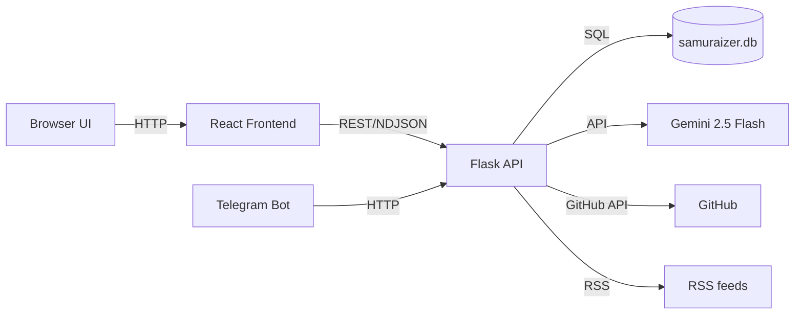

# Samuraizer — Cyber‑Security Insight Engine

[](LICENSE) [](https://www.python.org/) [](https://reactjs.org/) [](https://cloud.google.com/vertex-ai)

Samuraizer ingests URLs (GitHub repos, CVE writeups, blog posts, etc.), summarizes them using *Gemini 2.5 Flash*, categorizes/tags them, and stores results in a local SQLite knowledge base.

You can interact via:
- 🌐 **Web UI** (React + Tailwind)
- 🤖 **Telegram bot** (optional)

---

## 🧩 What you get (at-a-glance)

### Knowledge Base (Web UI)
- 📝 Add any URL and get a clean summary + tags + category
- ✏️ Inline tag editing (add/remove tags on entries, feeds, and list items)
- 🔎 Semantic search (vector search using Gemini embeddings) + classic text search
- 🧩 Tag cloud + multi-filtering (by tag, category, source, list, read/useful)
- 📚 List management (groups of entries, RSS lists, manual lists)
- 👁️‍🗨️ Built-in “hover preview” (summary cards) and quick copy buttons

### RSS / Blog Feed Support
- Add RSS feeds and Samuraizer auto‑polls them periodically
- New posts are automatically ingested and summarized
- Each feed becomes its own “list”, making it easy to batch-review
- Feed items show source metadata and can be tagged/filtered like any entry

### Telegram Bot (Optional)
- Send URLs to the bot, and it will analyze them through the same backend
- Live progress updates and formatted result cards
- Works with arbitrary URLs (GitHub repos, blog posts, CVEs, etc.)

### Chat (RAG + streaming)
- 💬 Ask questions over your knowledge base (GitHub repos, writeups, blog posts)
- 🔗 Answers are sourced from the best matching entries (retrieval-augmented generation)
- ⚡ Streaming responses with live typing and source citations
- 🗂️ Multiple chat sessions with saved history and model selection

### API + Developer Features
- Stream results from `/analyze` as NDJSON for progress updates
- Patch entries via `PATCH /entries/<id>` to update tags, useful state, or read/useful flags
- Built-in SQLite persistence in `samuraizer.db`
- Tag sanitization ensures consistent tagging (lowercase, deduped, normalized)
- Chat endpoints: `/chat/sessions`, `/chat/sessions/<id>/messages`, `/chat` (streaming RAG)

---

## 🏗 Architecture (high-level)



---

## 📸 Screenshots (placeholders)

### Web UI — Knowledge Base

*Replace with a screenshot of the main knowledge base view.*

### Telegram bot (optional)

*Replace with a screenshot of the bot responding to a URL.*

---

## 🧠 How it works (end-to-end)

1. **Submit a URL** via the web UI (or Telegram bot).
2. Backend determines the type (GitHub repo, blog post, RSS feed, etc.) and fetches content.
3. Content is sent to **Gemini 2.5 Flash** to generate:
   - A concise summary
   - A category and tags
   - (Optionally) embeddings used for semantic search
4. Results are stored in `samuraizer.db` and surfaced in the frontend.
5. The frontend lets you:
   - Filter by tags, category, source, list, read/useful flags
   - Edit tags inline (updates persisted via `PATCH /entries/<id>`)
   - Use semantic search (vector search over Gemini embeddings)
6. RSS feeds are polled periodically; new posts are automatically ingested.

---

## 🧰 Tech Stack

| Layer     | Tech / Libraries                      |
|-----------|----------------------------------------|
| Backend   | Python, Flask, SQLite, feedparser      |
| LLM       | Gemini 2.5 Flash (Gemini API)          |
| Frontend  | React 18, Vite, Tailwind CSS           |
| Bot       | python-telegram-bot v20                |

---

## ⚙️ Setup (Local)

### 1) Config 🔐
Create a `.env` in the project root:

```env
GEMINI_API_KEY=your_key_here
TELEGRAM_BOT_TOKEN=optional
GITHUB_TOKEN=optional
SAMURAIZER_URL=http://localhost:8000
```

### 2) Install dependencies 📦

```bash
pip install -r requirements.txt
cd frontend && npm install
```

### 3) Run backend ▶️

```bash
python server.py
```

### 4) Run frontend 🌐

```bash
cd frontend
npm run dev
```

### 5) (Optional) Run Telegram bot 🤖

```bash
python telegram_bot.py
```

---

## 📦 API Endpoints

### Analyze a URL
`POST /analyze`

Body:
```json
{ "url": "https://github.com/owner/repo" }
```

### List entries
`GET /entries` (supports filters: `search`, `category`, `tag`, `source`, `list_id`, `read`, `useful`)

### Manage tags
- Tag edits happen via `PATCH /entries/<id>` with JSON `{ "tags": ["tag1","tag2"] }`

---

## 🧠 Notes

- The `functions/` directory and `firebase.json` are legacy and not used.
- The knowledge base uses `source` values: `manual` and `rss`.
- Tags are sanitized (lowercased, de-duped) before storing.
- Embeddings use **gemini-embedding-2-preview** and are stored in chunked form (`entry_chunks` table) so the full article can be searched.
- Run **Embed all entries** after initial setup or when updating the embedding model.

---

## 🙌 Contributing

1. Fork
2. Create a branch
3. Make changes
4. Submit a PR

---

## ⚖️ License
MIT
